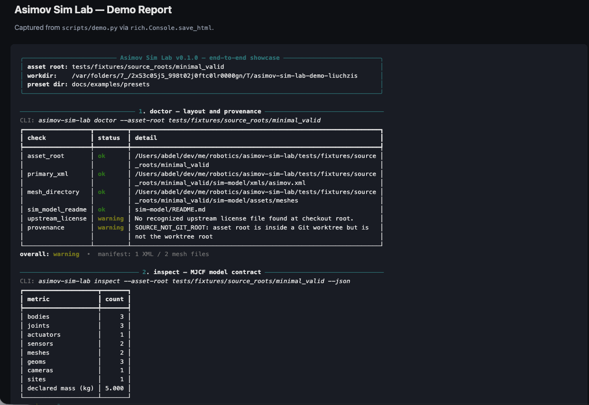
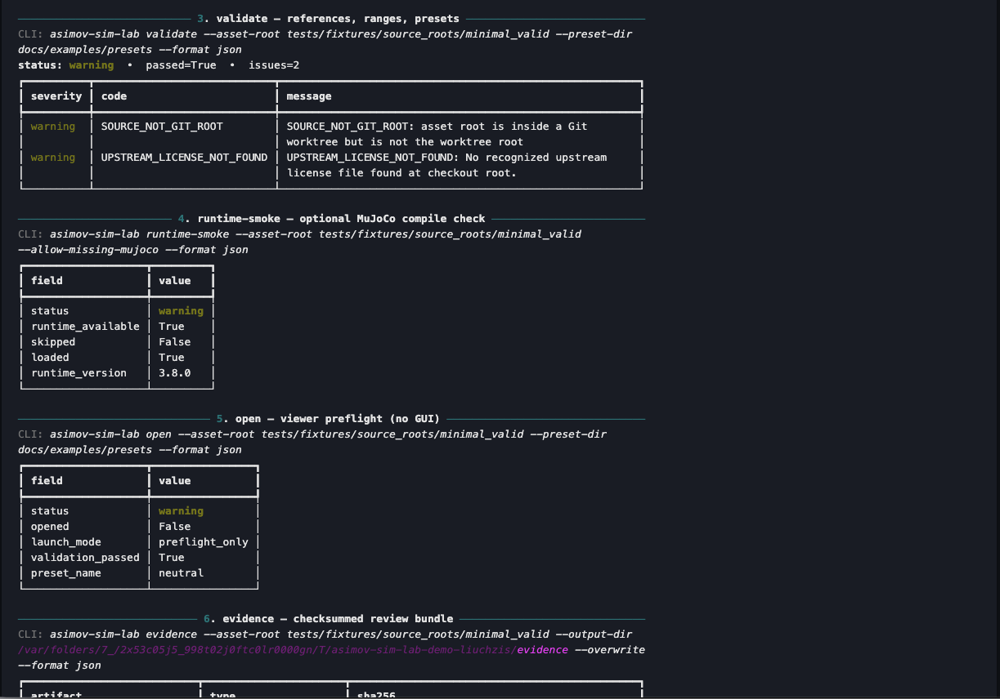
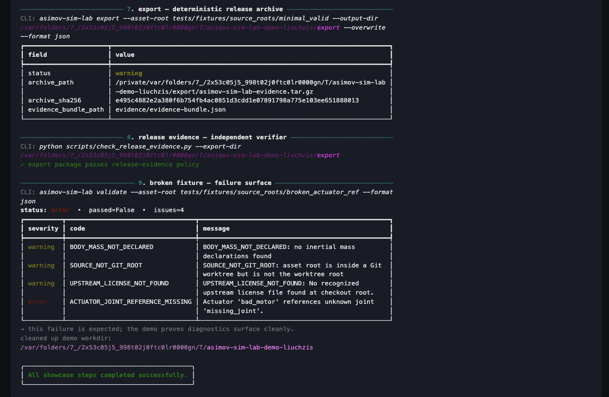
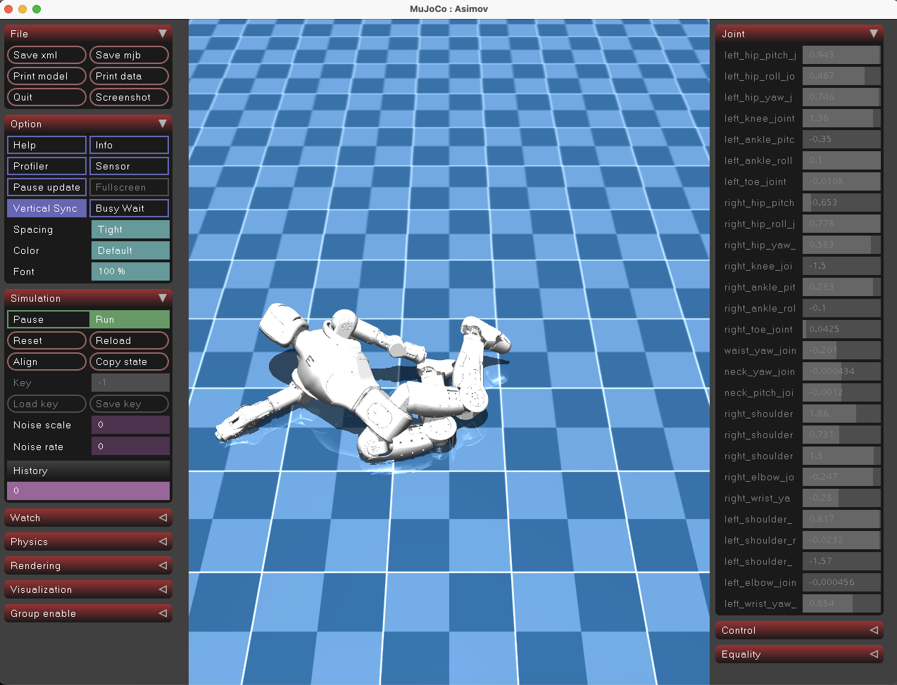

<div align="center">

# Asimov Sim Lab

**Spec-first inspection, validation, and evidence packaging for the [Asimov v1](https://github.com/k-scale/asimov) MuJoCo humanoid model.**

[](https://github.com/AbdelStark/asimov-sim-lab/actions/workflows/ci.yml)
[](https://pypi.org/project/asimov-sim-lab/)
[](https://www.python.org/downloads/)
[](LICENSE)
[](https://github.com/astral-sh/ruff)
[](https://mypy-lang.org/)
[](https://github.com/astral-sh/uv)
[](https://mujoco.org/)
[](https://docs.pydantic.dev/)

</div>

---

<table align="center">
  <tr>
    <td align="center" width="50%">
      <br />
      <sub><b>doctor + inspect</b> — layout, provenance, and MJCF model summary at a glance</sub>
    </td>
    <td align="center" width="50%">
      <br />
      <sub><b>validate + runtime-smoke + viewer-preflight</b> — static checks, MuJoCo compile, and viewer sanity</sub>
    </td>
  </tr>
  <tr>
    <td align="center" width="50%">
      <br />
      <sub><b>evidence + export</b> — deterministic release archives and clear failure surfacing on broken fixtures</sub>
    </td>
    <td align="center" width="50%">
      <br />
      <sub><b>viewer</b> — the validated Asimov v1 humanoid loaded in the MuJoCo runtime</sub>
    </td>
  </tr>
</table>

---

Asimov Sim Lab turns a raw MuJoCo robot checkout — XML, STL meshes, presets — into **machine-readable, schema-backed evidence**: asset manifests, model contracts, validation reports, runtime smoke checks, and reproducible export bundles. Every artifact is content-addressed, versioned, and round-trippable via JSON Schema.

## Features

- **Schema-backed contracts.** Every output is a Pydantic model with a published [JSON Schema](docs/schemas/) — safe to consume from any language.
- **Deterministic by default.** Stable artifact ordering, normalized timestamps, reproducible tarball hashes.
- **Content-addressed evidence.** SHA-256 checksums for every XML, mesh, preset, and bundle artifact.
- **MJCF inspection.** Bodies, joints, actuators, sensors, meshes, geoms, cameras, sites, declared masses, passive-joint inference.
- **Static validation.** Mesh references, geom→mesh links, actuator/sensor targets, joint ranges, preset compatibility.
- **Optional runtime smoke.** Compile the MJCF through real MuJoCo to verify it loads.
- **Provenance tracking.** Git URL, commit, branch, dirty state, untracked count.
- **Strict typing.** `mypy --strict`, `extra="forbid"` Pydantic models, typed CLI exit codes.
- **Zero external services.** Reads a local checkout; never phones home.

## Install

Requires Python `>= 3.12`, [`uv`](https://github.com/astral-sh/uv), and a local Asimov v1 checkout containing `sim-model/xmls/asimov.xml`.

```bash
git clone https://github.com/AbdelStark/asimov-sim-lab
cd asimov-sim-lab
uv sync --extra dev               # library + CLI + dev tooling
uv sync --extra dev --extra viewer  # add the optional MuJoCo runtime
```

The CLI is exposed as `asimov-sim-lab` (run via `uv run asimov-sim-lab ...`).

## Quick Start

```bash
# Point at an upstream checkout
export ASIMOV_SIM_LAB_ASSET_ROOT=/path/to/asimov-v1

# Verify layout, hash assets, parse MJCF, validate, package evidence
uv run asimov-sim-lab doctor   --format json
uv run asimov-sim-lab inspect  --json
uv run asimov-sim-lab validate --format json
uv run asimov-sim-lab evidence --output-dir ./evidence --overwrite --format json
uv run asimov-sim-lab export   --output-dir ./export   --overwrite --format json
```

Or run the full pipeline against the bundled synthetic fixture (no upstream checkout required):

```bash
make demo            # end-to-end CLI walkthrough + HTML report
make viewer-demo     # preflight, then launch the interactive MuJoCo viewer
```

`viewer-demo` requires the optional viewer extra (`uv sync --extra viewer`) and uses the synthetic fixture by default; set `ASIMOV_SIM_LAB_ASSET_ROOT` to point at a real upstream checkout.

## CLI

| Command | Purpose | Output |
| --- | --- | --- |
| `doctor` | Resolve asset root, check layout, read Git provenance | `DoctorResult` |
| `inspect` | Parse MJCF into a stable model contract | `InspectResult` |
| `validate` | Static checks against MJCF, meshes, presets | `ValidationResult` |
| `runtime-smoke` | Compile the MJCF through MuJoCo (optional) | `RuntimeSmokeResult` |
| `open` | Preflight viewer launch (no GUI) | `ViewerOpenResult` |
| `evidence` | Bundle every artifact into a checksummed directory | `EvidenceBundleResult` |
| `export` | Produce a deterministic `.tar.gz` from the bundle | `ExportPackageResult` |

All commands accept `--format text|json` (and `--markdown` where applicable), `--asset-root`, `--profile`, and `--strict`.

### Exit codes

| Code | Meaning |
| --- | --- |
| `0` | Success (warnings allowed) |
| `1` | Validation failed or contract parsing failed |
| `2` | Invalid CLI usage or output path |
| `3` | Missing or unsupported source layout |

## Python API

Every CLI command has a typed library entry point. Results are Pydantic models — `.model_dump()` for dicts, `.model_dump_json()` for JSON.

```python
from pathlib import Path

from asimov_sim_lab import (
    inspect_model,
    resolve_asset_root,
    run_runtime_smoke,
    validate_model,
)

resolution = resolve_asset_root(asset_root=Path("/path/to/asimov-v1"), profile_path=None)

inspect = inspect_model(resolution)
print(inspect.model_name, inspect.body_count, inspect.joint_count)

validation = validate_model(resolution)
assert validation.passed, validation.issues

smoke = run_runtime_smoke(resolution, require_mujoco=True)
assert smoke.loaded, smoke.failure_message
```

Bundle and archive an entire run:

```python
from asimov_sim_lab import generate_evidence_bundle, generate_export_package

bundle = generate_evidence_bundle(resolution, output_dir=Path("./evidence"), overwrite=True)
package = generate_export_package(resolution, output_dir=Path("./export"), overwrite=True)

print(package.archive_path, package.archive_sha256)
```

## Configuration

Configure the asset root through any of (precedence: CLI > profile > env):

```bash
uv run asimov-sim-lab inspect --asset-root /path/to/asimov-v1
```

```bash
export ASIMOV_SIM_LAB_ASSET_ROOT=/path/to/asimov-v1
```

```toml
# .asimov-sim-lab/profile.toml
schema_version       = "0.1.0"
default_asset_root   = "/path/to/asimov-v1"
strict_validation    = true
```

`.asimov-sim-lab/` is local state. Do not commit machine-specific paths.

## Schemas

JSON is the source of truth; text and Markdown are renderings. Every result type is published as a versioned JSON Schema:

```
docs/schemas/
├── asset-manifest.schema.json
├── doctor-result.schema.json
├── error-result.schema.json
├── evidence-bundle-result.schema.json
├── export-package-manifest.schema.json
├── export-package-result.schema.json
├── inspect-result.schema.json
├── runtime-smoke-result.schema.json
├── validation-result.schema.json
└── viewer-open-result.schema.json
```

Schemas are regenerated from the Pydantic models — drift is caught in CI:

```bash
make schemas-update     # regenerate
make schemas            # check (CI-equivalent)
```

## Architecture

```
cli.py
 ├─ paths.py        asset-root resolution, layout checks, Git provenance
 ├─ manifest.py     SHA-256 manifest of XML + meshes
 ├─ inspect.py      MJCF parse → InspectResult
 ├─ validation.py   static checks (refs, ranges, sensors, actuators, presets)
 ├─ presets.py      built-in + local TOML presets
 ├─ runtime.py      optional MuJoCo compile smoke
 ├─ viewer.py       preflight viewer/open contract
 ├─ evidence.py     checksummed bundle directory
 ├─ export.py       deterministic tar.gz archive
 └─ models.py       Pydantic contracts + schema versions
```

See [docs/ARCHITECTURE.md](docs/ARCHITECTURE.md) for invariants, data flow, and failure modes.

## Development

```bash
uv sync --extra dev --extra viewer
make check                # lint + types + schemas + registry + tests + build + audit
```

Individual gates:

```bash
make lint        # ruff format + ruff check
make type        # mypy --strict
make test        # pytest with branch coverage (>= 90%)
make schemas     # JSON Schema drift check
make registry    # error-code registry parity
make security    # pip-audit
make build       # uv build
```

Run the pipeline against a real upstream checkout:

```bash
ASIMOV_SIM_LAB_ASSET_ROOT=/path/to/asimov-v1 make smoke-real
```

## Contributing

Read [CONTRIBUTING.md](CONTRIBUTING.md), [AGENTS.md](AGENTS.md), and [docs/spec/PRODUCT-SPEC.md](docs/spec/PRODUCT-SPEC.md). Changes are contract-first: code, tests, schemas, docs, and the [error-code registry](docs/spec/ERROR-CODE-REGISTRY.md) move together.

## Security

Vulnerabilities: please report privately. See [SECURITY.md](SECURITY.md).

## License

[MIT](LICENSE)
